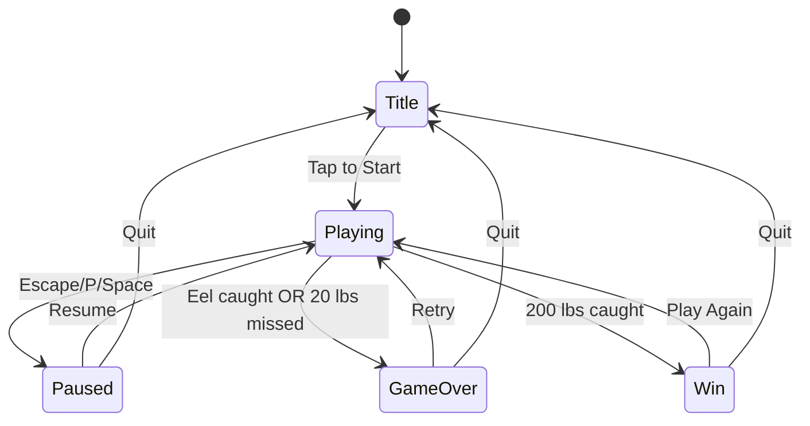
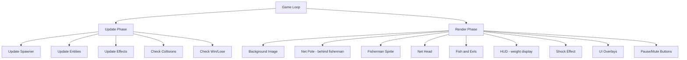
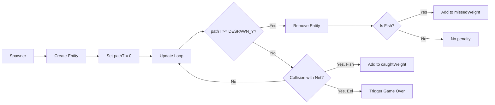
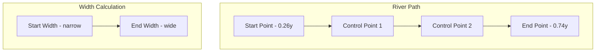
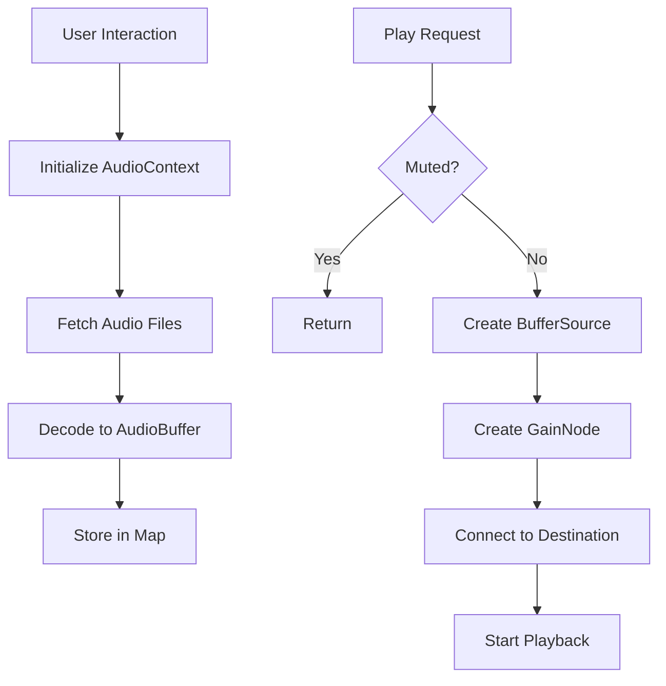
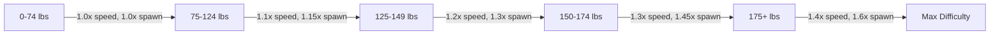

# Neon River - Architecture

Technical documentation for the Neon River game architecture.

---

## Table of Contents

- [Overview](#overview)
- [Directory Structure](#directory-structure)
- [Game State Machine](#game-state-machine)
- [Render Pipeline](#render-pipeline)
- [Entity Lifecycle](#entity-lifecycle)
- [River Path System](#river-path-system)
- [Audio System](#audio-system)
- [Difficulty System](#difficulty-system)
- [Key Classes](#key-classes)

---

## Overview

Neon River is a 2D arcade fishing game built with TypeScript and the Canvas API. The architecture follows a component-based design with clear separation between:

- **Game Logic** -- Spawning, collision detection, difficulty scaling
- **Entities** -- Fish, eels, and the player-controlled net
- **Rendering** -- Sprite rendering with perspective scaling
- **UI** -- Screens, overlays, and HUD elements
- **Audio** -- Web Audio API for low-latency sound

The game runs at 60 FPS using `requestAnimationFrame` with delta-time updates for smooth animation regardless of frame rate variations.

---

## Directory Structure

```
src/
├── main.ts              # Entry point, game loop, state management
├── assets/              # Sprite definitions and color palettes
├── game/                # Core game logic (Spawner, Collision)
├── entities/            # Game entities (Net, Fish, Eel)
├── scene/               # Background and static scene elements
├── effects/             # Visual effects (shock, ripples)
├── audio/               # Web Audio API manager
├── input/               # Mouse/touch input handling
├── ui/                  # UI screens and HUD
├── renderer/            # Sprite rendering utilities
└── utils/               # Constants, types, helper functions
```

---

## Game State Machine

The game uses a finite state machine with five states:



### State Descriptions

| State      | Description                    |
| ---------- | ------------------------------ |
| `title`    | Start screen with instructions |
| `playing`  | Active gameplay                |
| `paused`   | Game paused, overlay shown     |
| `gameover` | Player lost, stats displayed   |
| `win`      | Player won, celebration screen |

### State Transitions

State transitions are handled in `main.ts` through dedicated functions:

- `startGame()` -- Title/GameOver/Win -> Playing
- `pauseGame()` -- Playing -> Paused
- `resumeGame()` -- Paused -> Playing
- `goToTitle()` -- Any -> Title
- `triggerGameOver()` -- Playing -> GameOver
- `triggerWin()` -- Playing -> Win

---

## Render Pipeline

The render pipeline draws layers in a specific order to create proper depth:



### Layer Order (back to front)

1. **Background Image** -- Static pre-rendered scene
2. **Net Pole** -- Extends from fisherman to net head
3. **Fisherman** -- Static sprite on bridge
4. **Net Head** -- Player-controlled catch area
5. **Fish/Eels** -- Swimming entities with perspective scaling
6. **HUD** -- Stone tablet weight display
7. **Effects** -- Shock animation, ripples
8. **UI Overlays** -- Title, pause, game over, win screens
9. **Buttons** -- Pause and mute buttons (always on top)

---

## Entity Lifecycle

Fish and eels follow a path-based lifecycle:



### Path Parameter (pathT)

Each entity tracks its position along the river using `pathT`:

- `pathT = 0` -- Entity spawns at river source
- `pathT = 1` -- Entity reaches despawn point
- Entities move by incrementing `pathT` based on speed and delta time

### Perspective Scaling

Entities scale based on their `pathT` value:

```typescript
getScale(): number {
  const normalizedT = Math.max(0, this.pathT);
  return FISH_BASE_SCALE * (0.8 + normalizedT * 0.3);
}
```

This creates a perspective effect where fish appear smaller at the river source and larger as they approach the net.

---

## River Path System

Fish follow a bezier curve representing the river's flow:



### Bezier Curve Implementation

The river path is defined by four control points forming a cubic bezier curve:

```typescript
const RIVER_PATH = {
  start: { x: 0.5, y: 0.26 }, // River source (top)
  control1: { x: 0.48, y: 0.4 }, // First bend
  control2: { x: 0.52, y: 0.55 }, // Second bend
  end: { x: 0.5, y: 0.74 }, // Near bridge
};
```

### Key Functions

- `getRiverPoint(t)` -- Returns x,y coordinates for a given t value
- `getRiverWidth(t)` -- Returns river width at a given t value (widens toward player)

### Lateral Movement

Fish have a `lateralOffset` that positions them within the river width:

- Range: -0.4 to +0.4 (relative to river center)
- Fish bounce off edges when they reach bounds
- Wave-based spawning creates coordinated movement patterns

---

## Audio System

The audio system uses the Web Audio API for low-latency playback:



### Why Web Audio API?

| HTMLAudioElement             | Web Audio API         |
| ---------------------------- | --------------------- |
| Decodes on each play         | Pre-decodes once      |
| 100-300ms latency on mobile  | 5-20ms latency        |
| Creates new element per play | Reuses decoded buffer |

### AudioManager Methods

- `init()` -- Must be called after user interaction (mobile requirement)
- `play(name)` -- Play a pre-loaded sound
- `toggleMute()` -- Toggle mute state (persisted to localStorage)
- `isMuted()` -- Check current mute state

---

## Difficulty System

Difficulty scales with caught weight through tiered multipliers:



### Difficulty Tiers

```typescript
const DIFFICULTY_TIERS = [
  { threshold: 75, speedMult: 1.1, spawnMult: 1.15 },
  { threshold: 125, speedMult: 1.2, spawnMult: 1.3 },
  { threshold: 150, speedMult: 1.3, spawnMult: 1.45 },
  { threshold: 175, speedMult: 1.4, spawnMult: 1.6 },
];
```

### Eel Fairness System

To ensure the game remains skill-based:

- **Eel Cooldown**: 1.8 second minimum gap between eel spawns
- **Eel Boost**: +15% eel spawn chance after 75 lbs caught
- If an eel would spawn during cooldown, a bluegill spawns instead

---

## Key Classes

### main.ts

The entry point manages:

- Canvas setup and scaling
- Game state machine
- Input event handlers
- Main game loop (update + render)
- Audio initialization

### Spawner

Manages entity creation and lifecycle:

- Wave-based spawn positioning
- Difficulty-adjusted spawn rates
- Entity removal and weight tracking
- Eel cooldown enforcement

### Net

Player-controlled entity:

- Position clamped to river bounds
- Split rendering (pole behind fisherman, head in front)
- Catch animation (wobble effect)
- Collision hitbox (front 35% of height)

### SpriteRenderer

Handles sprite drawing:

- Palette-based pixel art rendering
- Multi-frame animation support
- Dynamic scaling for perspective
- Centered anchor point

### Entity Classes (Bluegill, GoldenKoi, ElectricEel)

Each entity:

- Follows river path using bezier interpolation
- Has lateral drift with bounce-back at edges
- Scales based on path position
- Updates sprite animation

### UI Screens

Each screen (TitleScreen, PauseOverlay, GameOverScreen, WinScreen):

- Handles its own animation timing
- Provides button hit detection methods
- Renders overlay and content
- Resets state when shown

---

## Performance Considerations

1. **Static Background**: Pre-rendered image instead of layered parallax reduces draw calls
2. **Sprite Caching**: Sprites rendered once and reused
3. **Delta Time**: All updates use delta time for consistent behavior
4. **Frame Cap**: Delta capped at 0.1s to prevent physics issues
5. **Minimal Allocations**: Object pools could be added for high-frequency spawning

---

## Future Improvements

Potential architectural enhancements:

- Entity pooling for reduced garbage collection
- WebGL renderer for better performance
- State machine library for complex state logic
- Event system for decoupled communication
- Save system for high scores
