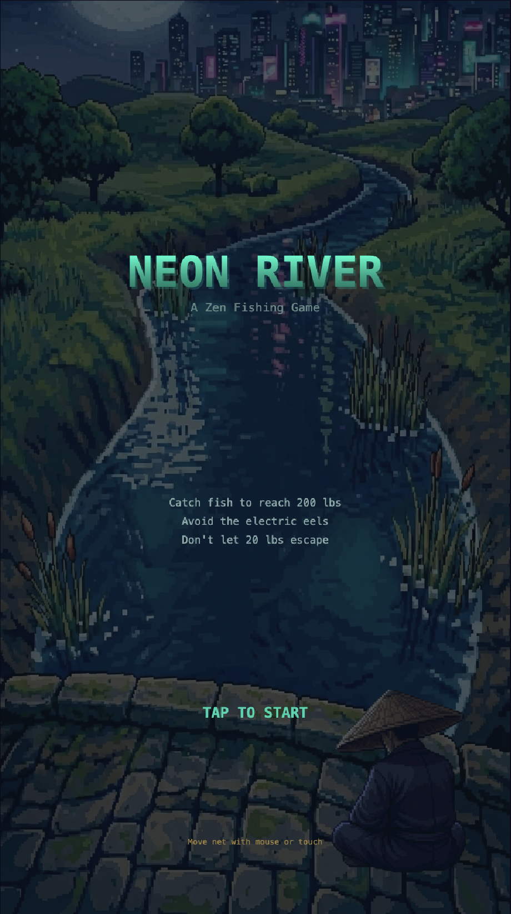

# Neon River

A pixel art arcade fishing game inspired by the fishing minigame from Jak and Daxter. Catch fish to reach 200 lbs while avoiding deadly electric eels.



**[Play Now - neonriver.kahdev.me](https://neonriver.kahdev.me)**

---

## Table of Contents

- [Features](#features)
- [How to Play](#how-to-play)
- [Quick Start](#quick-start)
- [Development](#development)
- [Tech Stack](#tech-stack)
- [Project Structure](#project-structure)
- [Deployment](#deployment)
- [Version Management](#version-management)
- [License](#license)

---

## Features

### Gameplay

- **Wave-based fish spawning** - coordinated, zen-like movement patterns
- **Progressive difficulty** - fish speed and spawn rate increase as you catch more
- **Three entity types** - Bluegill (common), Golden Koi (rare, valuable), Electric Eel (deadly)
- **Skill-based challenge** - eel cooldown system ensures fair difficulty

### Visual Style

- **16-bit pixel art aesthetic** with hand-crafted sprites
- **Animated electric sparks** on eels with cycling yellow/cyan lightning
- **Perspective scaling** - fish grow larger as they approach the net
- **Smooth animations** - net wobble on catch, shock effect on eel contact

### Audio

- **Web Audio API** for low-latency sound on mobile
- **Catch sound effect** with overlap support for rapid catches
- **Mute toggle** with persistent preference (localStorage)

### UI/UX

- **Full game flow** - Title screen, Pause overlay, Game Over, Win screen
- **Mobile-friendly** - Touch controls, responsive canvas, no keyboard required
- **HUD** - Stone tablet style weight display with progress indicators

---

## How to Play

### Controls

- **Desktop**: Move mouse left/right to position the net
- **Mobile**: Touch and drag to move the net
- **Pause**: Press Escape, P, Space, or tap the pause button

### Win Condition

Catch **200 lbs** of fish to win.

### Lose Conditions

- Let **20 lbs** of fish escape past your net
- Catch an **Electric Eel** (instant game over)

### Fish Types

| Entity       | Weight | Speed  | Notes                      |
| ------------ | ------ | ------ | -------------------------- |
| Bluegill     | 1 lb   | Medium | Common, steady drift       |
| Golden Koi   | 5 lbs  | Fast   | Rare, quick movement       |
| Electric Eel | --     | Slow   | Deadly! Avoid at all costs |

### Difficulty Progression

| Caught Weight | Fish Speed | Spawn Rate | Eel Chance |
| ------------- | ---------- | ---------- | ---------- |
| 0-74 lbs      | 1.0x       | 1.0x       | Normal     |
| 75-124 lbs    | 1.1x       | 1.15x      | +15%       |
| 125-149 lbs   | 1.2x       | 1.3x       | +15%       |
| 150-174 lbs   | 1.3x       | 1.45x      | +15%       |
| 175+ lbs      | 1.4x       | 1.6x       | +15%       |

---

## Quick Start

```bash
# Clone the repository
git clone https://github.com/khesse-757/neon-river.git
cd neon-river

# Install dependencies
npm install

# Start development server
npm run dev
```

Open [http://localhost:5173](http://localhost:5173) in your browser.

---

## Development

### Prerequisites

- Node.js 20+
- npm 9+

### Setup

```bash
npm install          # Install dependencies
npm run dev          # Start dev server with hot reload
```

### Available Scripts

| Script              | Description                                   |
| ------------------- | --------------------------------------------- |
| `npm run dev`       | Start Vite dev server (http://localhost:5173) |
| `npm run build`     | Production build to `dist/`                   |
| `npm run preview`   | Preview production build                      |
| `npm run test`      | Run Vitest in watch mode                      |
| `npm run test:run`  | Run tests once                                |
| `npm run lint`      | ESLint check                                  |
| `npm run lint:fix`  | ESLint auto-fix                               |
| `npm run typecheck` | TypeScript type check                         |
| `npm run check`     | Run all checks (lint + typecheck + test)      |
| `./bump-version.sh` | Interactive version bump                      |

### Pre-commit Hooks

Husky runs `npm run check` before each commit, ensuring:

- ESLint passes
- TypeScript compiles without errors
- All tests pass

---

## Tech Stack

| Technology    | Version | Purpose                   |
| ------------- | ------- | ------------------------- |
| TypeScript    | ^5.7    | Language (strict mode)    |
| Vite          | ^6.0    | Build tool and dev server |
| Vitest        | ^2.1    | Unit testing              |
| ESLint        | ^9.0    | Linting (flat config)     |
| Prettier      | ^3.4    | Code formatting           |
| Husky         | ^9.1    | Git hooks                 |
| lint-staged   | ^15.2   | Pre-commit checks         |
| Canvas API    | Native  | 2D rendering              |
| Web Audio API | Native  | Low-latency audio         |

---

## Project Structure

```
neon-river/
├── public/
│   ├── audio/                    # Sound effects
│   │   └── water_net.wav         # Catch sound
│   ├── images/
│   │   ├── neon-river-bg.png     # Background image
│   │   └── neon-river.png        # Screenshot
│   └── CNAME                     # Custom domain config
│
├── src/
│   ├── main.ts                   # Entry point, game loop
│   │
│   ├── assets/                   # Visual assets
│   │   ├── sprites/              # Sprite definitions
│   │   │   ├── bluegill.ts       # Bluegill fish sprite
│   │   │   ├── goldenKoi.ts      # Golden Koi sprite
│   │   │   ├── electricEel.ts    # Electric Eel sprite
│   │   │   ├── net.ts            # Net sprite
│   │   │   └── fisherman.ts      # Fisherman sprite
│   │   └── palettes/             # Color palettes
│   │
│   ├── game/                     # Core game logic
│   │   ├── Spawner.ts            # Fish/eel spawning with waves
│   │   ├── Collision.ts          # Hit detection
│   │   └── Difficulty.ts         # Difficulty curves
│   │
│   ├── entities/                 # Game entities
│   │   ├── Net.ts                # Player-controlled net
│   │   ├── Bluegill.ts           # Common fish
│   │   ├── GoldenKoi.ts          # Rare fish
│   │   └── ElectricEel.ts        # Deadly hazard
│   │
│   ├── scene/                    # Scene layers
│   │   ├── BackgroundImage.ts    # Static background
│   │   └── Fisherman.ts          # Fisherman sprite
│   │
│   ├── effects/                  # Visual effects
│   │   ├── ShockEffect.ts        # Eel shock animation
│   │   └── CatchRipple.ts        # Water ripple on catch
│   │
│   ├── audio/                    # Audio system
│   │   └── AudioManager.ts       # Web Audio API manager
│   │
│   ├── input/                    # Input handling
│   │   └── InputManager.ts       # Mouse/touch unified input
│   │
│   ├── ui/                       # User interface
│   │   ├── HUD.ts                # Weight display, pause button
│   │   ├── TitleScreen.ts        # Start screen
│   │   ├── PauseOverlay.ts       # Pause menu
│   │   ├── GameOverScreen.ts     # Death screen with stats
│   │   ├── WinScreen.ts          # Victory screen
│   │   └── MuteButton.ts         # Audio toggle
│   │
│   ├── renderer/                 # Rendering utilities
│   │   └── SpriteRenderer.ts     # Sprite drawing
│   │
│   └── utils/                    # Utilities
│       ├── constants.ts          # Game balance values
│       ├── riverPath.ts          # Bezier curve path
│       └── types.ts              # TypeScript types
│
├── tests/                        # Test files
│   ├── game/
│   │   ├── Spawner.test.ts
│   │   └── Collision.test.ts
│   └── utils/
│       └── constants.test.ts
│
├── .github/workflows/            # CI/CD
│   ├── ci.yml                    # Lint, typecheck, test
│   └── deploy.yml                # Deploy to GitHub Pages
│
├── index.html                    # Entry HTML
├── package.json
├── tsconfig.json
├── vite.config.ts
├── vitest.config.ts
├── eslint.config.js
├── VERSION                       # Current version
├── bump-version.sh               # Version bump script
├── CLAUDE.md                     # AI assistant instructions
├── ARCHITECTURE.md               # Technical architecture
└── LICENSE                       # MIT License
```

---

## Deployment

### GitHub Actions

The project uses two GitHub Actions workflows:

1. **CI** (`ci.yml`) - Runs on every push/PR to main:
   - Lint check
   - TypeScript type check
   - Unit tests
   - Build verification

2. **Deploy** (`deploy.yml`) - Runs on push to main:
   - Builds the project
   - Deploys to GitHub Pages

### Custom Domain

The game is deployed at [neonriver.kahdev.me](https://neonriver.kahdev.me).

To set up a custom domain:

1. Add a `CNAME` file to `public/` with your domain
2. Configure DNS to point to GitHub Pages
3. Enable HTTPS in repository settings

---

## Version Management

The project uses a `VERSION` file for version tracking.

### Bump Version

```bash
./bump-version.sh
```

Select the bump type:

1. **Patch** (0.0.x) - Bug fixes
2. **Minor** (0.x.0) - New features
3. **Major** (x.0.0) - Breaking changes

### Release Process

```bash
# Bump version
./bump-version.sh

# Commit and tag
git add VERSION package.json
git commit -m "chore: bump version to X.Y.Z"
git tag vX.Y.Z

# Push with tags
git push origin main --tags
```
